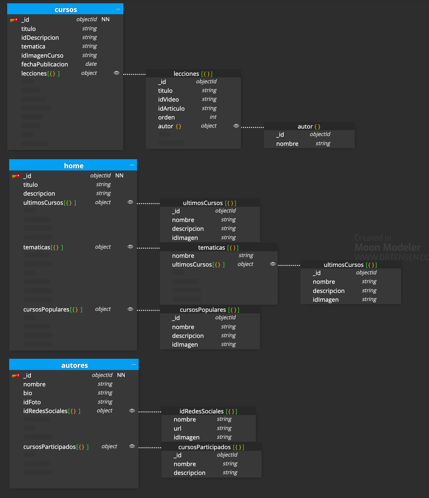

# backend-00-modelling-basic

Simulación de portal de vídeos orientados a la programación.

## Caso básico

Éste es el caso básico:

- Hemos resuelto a nivel de modelado la carga de las novedades, populares y tematizado de los cursos; en vez de caché. Hemos empleado el _subset pattern_: objetos con _id_ para viajar a la ficha del curso y los mínimos datos.
- He utilizado _id_ para consumo de recursos externos como vídeos e imágenes.
- He embebido las lecciones dentro de los cursos porque su volumen será reducido (1-20 vídeos máximo). En cursos, se pueden manejar los autores desde el _front_ sin campos calculados.
- En lecciones, también _subset pattern_ para autor (sólo uno por lección). Queremos cargar rápido su nombre y referenciar a la ficha. Por eso, autor es de tipo objeto. En la página de Autor, estarán el resto.
  Asimismo, se incluye el orden de las lecciones.
- En autores, el campo redes sociales tiene nombre, id para url de la red e imagen. El campo de los cursos en los que ha participado el autor puede ser problemático, pero esta página no tiene gran tráfico. Más adelante, nos podríamos plantear visualizar sólo los últimos cursos también como estrategia para el perfil de autor.
