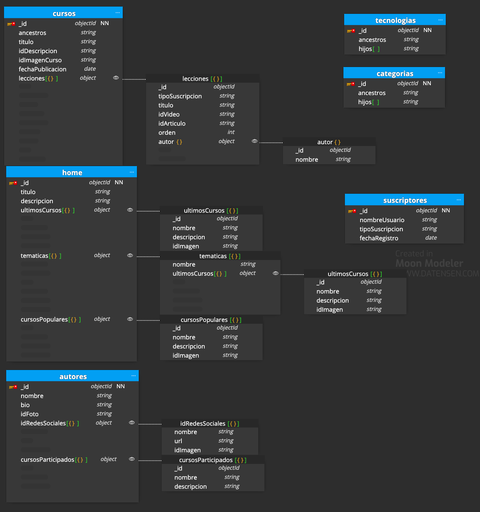

# backend-00-modelling-optional

Simulación de portal de vídeos orientados a la programación.

## Caso opcional

No se ha realizado el apartado desafío.

Éste es el caso opcional:

- En lecciones, se añade un campo respecto al tipo de suscripción bajo la que está disponible la unidad. Podemos tener diferentes clases de suscripciones y no sólo contenido para usuarios registrados y no registrados.
- Se emplea el _materialized path_ de los _tree patterns_. Al tener los cursos ancestros ya no necesito el campo de temáticas. Lo combinamos con encontrar a los hijos: _tree patterns child reference_.
